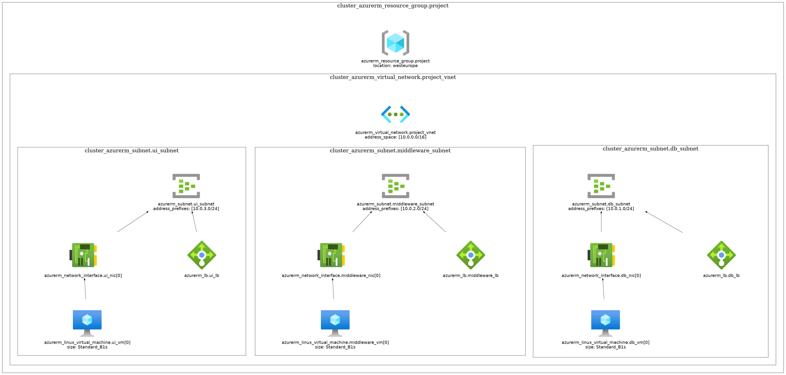

# demo-company-project

Demonstration of Terraview CLI application.

# Documentation

The web server is the presentation tier and provides the user interface. This is usually a web page or website, such as an ecommerce site where the user adds products to the shopping cart, adds payment details or creates an account. The content can be static or dynamic, and is developed using HTML, CSS, and JavaScript.

The application server corresponds to the middle tier, housing the business logic that is used to process user inputs. To continue the ecommerce example, this is the tier that queries the inventory database to return product availability, or adds details to a customer's profile. This layer often developed using Python, Ruby, or PHP and runs a framework such as Django, Rails, Symphony, or ASP.NET.

The database server is the data or backend tier of a web application. It runs on database management software, such as MySQL, Oracle, DB2, or PostgreSQL.